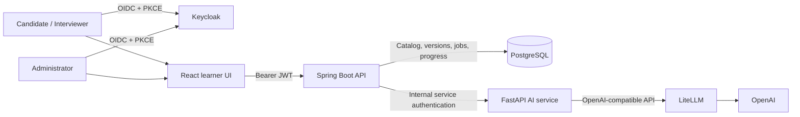
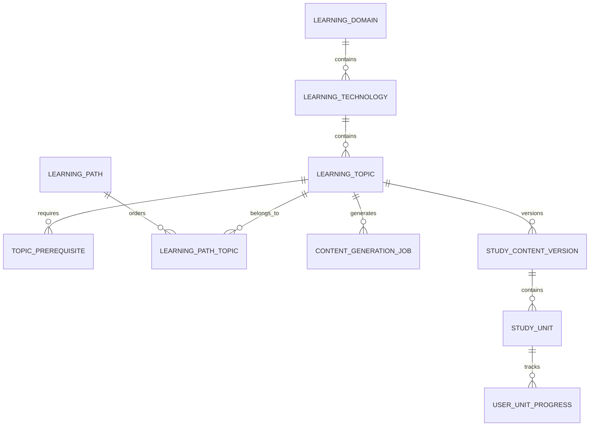
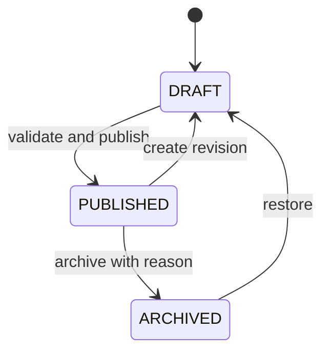
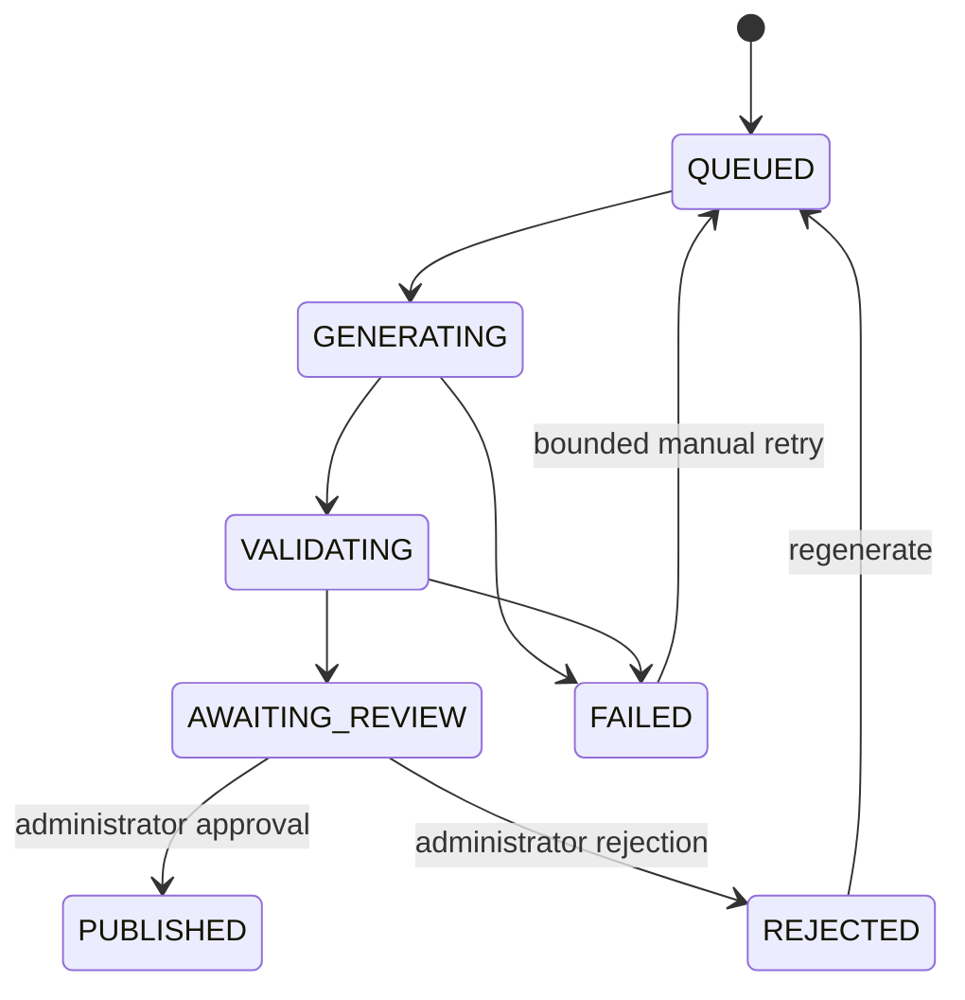

# Learning Hub — Study-Material Platform Design

Status: proposed implementation design
Scope: Phase 3, study material only
Out of scope: assessments, scoring, question banks, interview simulation, certificates, and multi-tenancy

## 1. Product outcome

Learning Hub provides a database-driven catalog of ecosystems, technologies, topics, and learning paths. OpenAI generates structured study-material drafts. Administrators review and publish immutable versions. Candidates and interviewers read the same material by default, while database-backed access policy can independently enable or disable either role without redeployment.

The platform must continue serving published material when OpenAI, LiteLLM, or the AI service is unavailable.

## 2. Design principles

1. PostgreSQL is the source of truth for curriculum, content state, and progress.
2. AI output is untrusted input and is never published directly.
3. Every publication is an immutable, attributable content version.
4. Learner reads never trigger synchronous AI generation.
5. Authorization is enforced by the API using verified identity plus effective access policy.
6. Administrative operations are auditable, idempotent, and protected against concurrent updates.
7. Unknown roles, capabilities, content states, and service identities default to deny.
8. Published content remains available during downstream outages.

## 3. System design



### Component ownership

| Component | Owns | Must not own |
|---|---|---|
| React | Catalog, lesson, progress, and admin experiences | Authorization decisions or authoritative state |
| Spring Boot | Domain rules, policy enforcement, publication, jobs, progress, audit | Prompt execution or provider credentials |
| FastAPI | Versioned prompts, provider calls, output validation and normalization | Database writes, authorization, or publication |
| PostgreSQL | Durable curriculum, drafts, versions, jobs, progress and audits | Runtime secrets |
| Keycloak | Authentication, sessions and identity roles | Curriculum capabilities or content lifecycle |

V1 remains a modular monolith plus an internal AI service. No message broker, search cluster, or additional database is required.

## 4. Curriculum model



### Hierarchy

- `learning_domain`: administrator-created ecosystem such as Java, Python, AWS, or Data Engineering.
- `learning_technology`: a technology or subject area inside an ecosystem.
- `learning_topic`: the smallest curriculum item that receives generated material.
- `learning_topic_prerequisite`: directed, acyclic prerequisite relationship.
- `learning_path`: an ordered cross-technology sequence of topics.

All catalog resources use `DRAFT`, `PUBLISHED`, and `ARCHIVED`, an optimistic-lock version, stable UUID, unique slug within the parent, explicit ordering, and actor/timestamp metadata. Learner APIs expose only active, published resources.

### Content aggregate

- `study_content_version` is immutable after publication.
- `study_unit` contains ordered `OVERVIEW`, `THEORY`, `EXAMPLE`, `EXERCISE`, and `SUMMARY` units. `EXERCISE` is guided study material, not an assessed question.
- `learning_topic.current_content_version_id` points to the learner-visible version.
- `content_generation_job` provides durable, restart-safe orchestration.
- Publication atomically supersedes the previous version and switches the current pointer.

Published versions are never edited or deleted. Corrections create a new draft version. Historical learner progress remains linked to the version originally studied.

## 5. Lifecycle and workflows

### Curriculum lifecycle



Publishing an ecosystem validates its complete hierarchy: slug and order uniqueness, required topic objectives, valid durations, no prerequisite cycles, and at least one published topic. A draft or archived ancestor prevents learner visibility of all descendants.

### Content-generation lifecycle



1. An administrator requests generation for a published topic using an idempotency key.
2. Spring Boot creates or returns the single active job for that topic.
3. A bounded worker claims the job using a database lock and calls FastAPI.
4. FastAPI builds the server-controlled prompt, calls OpenAI through LiteLLM, and validates the response.
5. Spring Boot independently validates and persists a draft content version.
6. An administrator previews, edits if necessary, and publishes or rejects it with a reason.
7. Publication atomically updates the current version and emits an audit event.

Learners cannot generate, review, or publish content in V1. This prevents unreviewed AI material from becoming authoritative and provides predictable cost control.

### Progress workflow

- Opening a topic records first/last access against the current content version.
- Unit completion is an idempotent API operation derived from the authenticated subject.
- Topic, technology, domain, and path progress are calculated server-side.
- Publishing a new version preserves earlier history and starts separate progress for the new version.
- The UI labels a newer version as updated; V1 does not automatically transfer completion.

## 6. AI generation contract

Spring Boot supplies trusted catalog metadata only:

```json
{
  "jobId": "uuid",
  "promptVersion": "study-material-v1",
  "topic": {
    "id": "uuid",
    "domain": "Java",
    "technology": "Core Java",
    "title": "Java Collections",
    "summary": "Choose and use collection types effectively.",
    "skillLevel": "INTERMEDIATE",
    "estimatedMinutes": 90,
    "objectives": ["Compare List, Set, Queue, and Map"]
  }
}
```

The AI service returns structured JSON containing the matching topic ID, title, introduction, 4–12 ordered units, and conclusion. Each unit has a stable key, allowed type, title, Markdown body, optional code, takeaways, and duration.

### Validation gates

1. JSON/schema validation using Pydantic.
2. Topic and job identity match.
3. Unit count, uniqueness, ordering, length, and total-duration bounds.
4. Markdown rejects raw HTML, executable content, images, unsafe protocols, and non-allowlisted links.
5. Code and Markdown are size limited and treated as display-only text.
6. No assessment, answer collection, credential, destructive, or embedded-instruction content.
7. A second equivalent validation in Spring Boot before persistence.
8. Administrator preview and explicit publication.

At most one schema-repair request is allowed. Provider, validation, or policy failures create a safe error code and retain no partially published content. Prompts, raw tokens, credentials, and hidden reasoning are never logged or stored.

## 7. Authorization model

| Capability | Candidate | Interviewer | Administrator |
|---|---:|---:|---:|
| `LEARNING_CATALOG_READ` | Configurable | Configurable | Allow |
| `LEARNING_CONTENT_READ` | Configurable | Configurable | Allow |
| `LEARNING_PROGRESS_WRITE` | Configurable | Configurable | Allow |
| `ADMIN_CATALOG_WRITE` | Deny | Deny | Allow |
| `CONTENT_GENERATE` | Deny | Deny | Allow |
| `ADMIN_CONTENT_REVIEW` | Deny | Deny | Allow |
| `ADMIN_CONTENT_PUBLISH` | Deny | Deny | Allow |
| `ADMIN_AUDIT_READ` | Deny | Deny | Allow |

Candidate and interviewer grants are initially identical. The existing shared/role-specific access setting determines whether their study grants change together or independently. API controllers and application services both enforce capabilities. The browser never supplies the authoritative user subject or role.

Publish, archive, regenerate, and access-policy changes require a recent authentication claim in production. A configurable two-person approval rule may require editor and publisher to be different subjects; it should be enabled before external production use.

## 8. API surface

### Learner API

| Method | Endpoint | Purpose |
|---|---|---|
| GET | `/api/v1/learning/domains` | Published ecosystems and aggregate progress |
| GET | `/api/v1/learning/domains/{slug}/technologies` | Ordered technologies |
| GET | `/api/v1/learning/technologies/{id}/topics` | Filtered topic catalog |
| GET | `/api/v1/learning/topics/{id}` | Topic metadata and content state |
| GET | `/api/v1/learning/topics/{id}/content` | Current published immutable version |
| GET | `/api/v1/learning/paths` | Published learning paths |
| POST | `/api/v1/learning/topics/{id}/access` | Record access |
| PUT | `/api/v1/learning/units/{id}/completion` | Idempotently update own progress |
| GET | `/api/v1/learning/progress/me` | Authenticated user's dashboard |

Read endpoints use cursor/page bounds where appropriate, `ETag` for immutable/current content, and `Cache-Control: private`. A version-specific content endpoint may be cached immutably because the version never changes.

### Administrative API

| Method | Endpoint | Purpose |
|---|---|---|
| POST/GET | `/api/v1/admin/ecosystems` | Create/list all lifecycle states |
| PATCH | `/api/v1/admin/ecosystems/{id}` | Optimistic metadata update |
| POST | `/api/v1/admin/ecosystems/{id}/publish` | Validate and publish |
| POST | `/api/v1/admin/ecosystems/{id}/archive` | Reversible archive with reason |
| POST/PATCH | `/api/v1/admin/ecosystems/{id}/technologies[...]` | Manage technologies |
| POST/PATCH | `/api/v1/admin/technologies/{id}/topics[...]` | Manage topic curriculum |
| POST | `/api/v1/admin/topics/{id}/generation-jobs` | Request a generated draft |
| GET | `/api/v1/admin/generation-jobs/{id}` | Monitor safe job state |
| GET/PATCH | `/api/v1/admin/content-versions/{id}` | Review/edit draft |
| POST | `/api/v1/admin/content-versions/{id}/publish` | Publish immutable version |
| POST | `/api/v1/admin/content-versions/{id}/reject` | Reject with reason |
| GET | `/api/v1/admin/audit-events` | Paginated audit history |

Administrative creates/actions require `Idempotency-Key`; mutable updates require `If-Match`. Conflicts return RFC 9457 `409` responses. Errors never expose provider output, prompts, stack traces, or secrets.

## 9. Frontend experience

### Learner routes

- `/learn`: ecosystems, recently studied topics, and progress summary.
- `/learn/:domainSlug`: technologies and domain progress.
- `/learn/topics/:topicId`: topic overview and ordered lesson units.
- `/learn/paths/:pathSlug`: ordered learning path.

The UI provides accessible loading skeletons, empty states, unavailable states, updated-version notices, AI-assisted-content disclosure, and resumable progress. Markdown is rendered through an allowlist sanitizer; raw HTML is disabled.

### Administrator routes

- `/admin/ecosystems`: lifecycle-aware catalog management.
- `/admin/ecosystems/:id`: hierarchy editor and validation results.
- `/admin/topics/:id/content`: generation status, draft editor, preview, validation and publication.
- `/admin/audit`: searchable operational and administrative history.

The admin UI displays effective permission, optimistic conflicts, publication diff, model/prompt metadata, validation warnings, and required confirmation/reason fields. Hidden buttons are a usability aid only; API authorization remains authoritative.

## 10. Reliability and operational design

- A database partial unique index prevents concurrent active generation for one topic.
- Workers claim jobs with `FOR UPDATE SKIP LOCKED` and bounded concurrency.
- Jobs have lease/heartbeat timestamps; stale jobs are safely retried or failed after restart.
- Provider calls use strict connect/read timeouts, jittered retry only for transient failures, and a circuit breaker.
- Per-admin, per-topic, and global generation quotas constrain cost.
- Content publication and current-version switching occur in one transaction.
- Catalog and published content work when the AI subsystem is unavailable.
- PostgreSQL backups include restore drills; published content and audit history follow retention policy.

### Observability

Track generation queue age/depth, job duration/outcome, provider latency/error class, token usage and estimated cost, draft review time, publication count, content-read latency, cache behavior, progress writes, and authorization denials. Correlation IDs cross API → AI service → LiteLLM. Logs identify content/job IDs and hashes—not content bodies, tokens, email addresses, or prompts.

## 11. Zero-trust controls

- Authenticate and authorize every public and internal request.
- Validate JWT issuer, signature, expiry, audience, and mapped roles at the API.
- Use workload identity or mTLS for API-to-AI communication in production; rotate the current static development token.
- Keep AI service, LiteLLM, Keycloak, and PostgreSQL off public ingress except the required Keycloak OIDC route.
- Maintain default-deny network policies with explicit service-to-service paths.
- Validate AI responses as hostile input and sanitize Markdown at storage and rendering boundaries.
- Encrypt transport, secrets, database backups, and provider credentials; never place secrets in images or Git.
- Append attributable audit events for catalog mutations, generation, review, publish, reject, archive, and policy decisions.

## 12. Test and quality strategy

| Layer | Required tests |
|---|---|
| Spring Boot | Domain invariants, authorization matrix, repositories, Flyway upgrade, concurrency, idempotency, publication transaction and API contracts |
| FastAPI | Prompt snapshots, Pydantic schema, malicious/malformed output, timeout/rate limit, repair, token limits and idempotency |
| React | Routes, permission-aware states, catalog/lesson rendering, progress, draft workflow, conflict/error/accessibility states |
| Contract | Spring request ↔ FastAPI response schema and version compatibility |
| End-to-end | Admin creates curriculum → generates → reviews → publishes → learner reads and records progress |
| Operational | Clean install, upgrade, rollback, backup restore, AI outage, stale jobs and load tests |

The existing minimum 95% line and branch coverage policy applies to Java, Python, and TypeScript. Coverage does not replace mutation/security/contract testing. CI blocks merge on lint, tests, migration verification, CodeQL, dependency policy, container scan, Helm validation, and smoke tests.

## 13. Implementation slices

### Slice 1 — Catalog foundation

- Flyway schema for ecosystems, technologies, topics, prerequisites and paths.
- Modular Spring Boot catalog domain and admin/learner APIs.
- Admin ecosystem/topic editor and learner catalog pages.
- Capability enforcement, optimistic locking and audit events.

Exit: an administrator can create and publish any ecosystem without code or deployment changes; learners see only authorized published items.

### Slice 2 — AI draft generation

- Generation job schema and restart-safe worker.
- Versioned FastAPI prompt and structured output contract.
- LiteLLM/OpenAI integration with validation, rate limits, retry and telemetry.
- Admin generation status and failure experience.

Exit: an administrator can create a validated draft; provider failure cannot affect published content.

### Slice 3 — Review and publication

- Draft editor and sanitized preview.
- Immutable content versions and atomic publish/supersede transaction.
- Step-up/two-person approval policy and publication audit trail.
- Learner lesson reader with caching and version disclosure.

Exit: reviewed material is published exactly once and becomes visible to authorized learners without overwriting history.

### Slice 4 — Progress and learning paths

- Unit/topic progress and aggregates.
- Resume/recent-learning dashboard and path progress.
- New-version behavior and historical progress display.

Exit: each authenticated user can manage only their own progress and resume a published lesson reliably.

### Slice 5 — Production readiness

- E2E, load, resilience, migration-upgrade and restore tests.
- Dashboards, alerts, quotas, retention and operational runbooks.
- Workload identity/mTLS for internal AI traffic and production step-up authentication.

Exit: all SLO, security, recovery, and deployment acceptance tests pass in staging before production promotion.

## 14. Acceptance criteria

1. An authorized administrator can create an arbitrary ecosystem and curriculum without a deployment.
2. Candidate and interviewer study access defaults to shared and can be configured independently.
3. Learners cannot see drafts, archived resources, jobs, provider details, or another user's progress.
4. OpenAI output cannot bypass schema, semantic, security, and administrator review gates.
5. Publishing creates an immutable version and preserves earlier content and progress.
6. Duplicate generation requests are idempotent and cannot create concurrent jobs for one topic.
7. Published lessons remain readable during OpenAI/LiteLLM/AI-service outage.
8. Every administrative mutation and publication decision has a redacted, attributable audit record.
9. All APIs return consistent RFC 9457 errors and propagate correlation IDs.
10. Quality, security, migration, container, and deployment gates pass before automatic promotion.

## 15. Decisions for implementation

- Human review is mandatory before publication in V1.
- Only administrators request generation in V1.
- Candidate and interviewer receive the same access by default; policy can separate them.
- Guided exercises may appear as explanatory material, but no answers, scores, or assessments are recorded.
- PostgreSQL-backed workers are sufficient for V1; introduce a broker only after measured throughput or isolation requires it.
- PostgreSQL search is the starting point; introduce a dedicated search engine only after relevance/scale evidence.
- OpenAI is reached through LiteLLM so the application contract, quotas, and observability remain provider-controlled.
